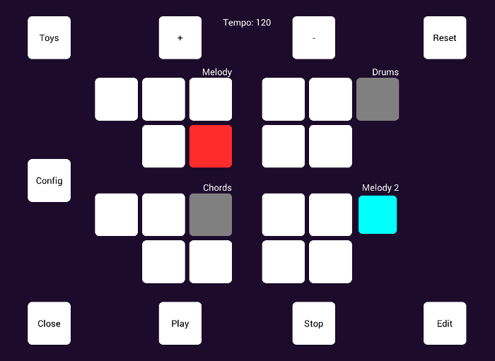

# Microsoft Hands-Free Sound Jam

"Microsoft Hands-Free Sound Jam" is an eye-controlled musical performance and 
composition environment.  The core interface implements what is known as a clip launcher, 
based on the the one found in the popular digital audio workstation Ableton Live.
In MSHFSJ, one is able to launch small musical fragments known as "clips", 
which are automatically aligned to the beat of the song. Clips can be launched
and mixed together in various combinations to play a song. 

This version of MSHFSJ is a prototype. The front UI aspects are written
in C using OpenGL via [NanoVG](http://www.github.com/memononen/nanovg) and
GLFW, and is meant to eventually be replaced with a Windows UI layer. 

MSHFSJ is an eye-controlled music environment for electronic loop-based 
performance and composition. It is designed using familiar design paradigms 
found in commercial music production software, which have been adapted to work 
well with eye control. The core interface revolves around what is known as a 
clip launcher, inspired by the the one found in the popular digital audio 
workstation Ableton Live. Using the MSHFSJ clip launcher, one is able perform a 
piece of music by scheduling, or "launching", small musical fragments, known as 
"clips", which are automatically aligned and quantized to the next downbeat of 
the song. Editing capabilities are provided through a editing window, where 
clips can be modified or rewritten entirely. Modified musical content will 
automatically be loaded and saved when the application is open and closed. 

MSHFSJ uses the PCEye Mini via the Tobii Stream Engine API for eye tracking. 
Graphics are drawn using OpenGL via NanoVG, a lightweight 2d vector graphics 
library. Persistent data storage is provided via SQLite. Realtime audio is 
achieved using RtAudio, and digitial signal processing is built on top of the 
musical audio signal processing library Soundpipe.

## Usage

Please refer to the [Usage](usage.md) file.

## Setup

On Windows, use the msys2 environment. On Linux, business as usual. Eye 
control is only available Windows. 

Now MSHFSJ can be compiled. 

On Linux, run:

    make linux

On Windows, run:

    make windows

For high-resolution windows displays (such as the surface), run:

    make windows-highres

Full instructions on building for on Windows can be found with the 
document [build-on-windows.md](build-on-windows.md).

Before running the program, assets from the other parts of this repository 
need to be transferred. Do this with:

    make transfer

## Screenshots

## Internal Engine Documentation

- [Minimum viable product API overview](src/dsp/jam/MVP.md)
- [General MSHFSJ functionality](src/dsp/jam/README.md)
- [Clips](src/dsp/jam/clip.md)
- [Tracks](src/dsp/jam/tracks.md)
- [Mixer](src/dsp/jam/mixer.md)
- [Data persistence and Database functionality](src/dsp/jam/db.md)
- [Clip Editing Interface](src/dsp/jam/edit.md)
